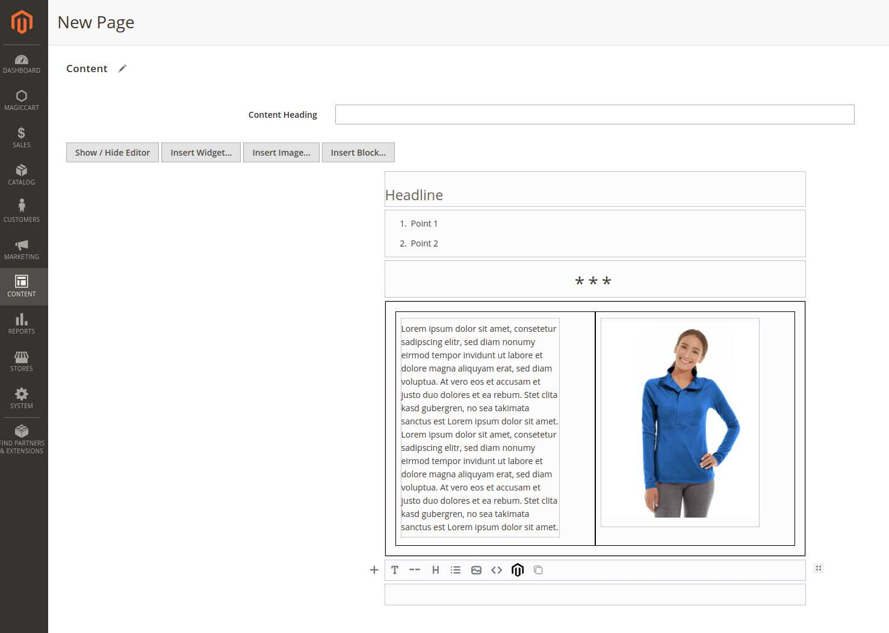

# EditorJS Integration for Magento 2

This module replaces the wysiwyg editor for cms pages with [EditorJS](https://editorjs.io/).

## Installation

Please note: the module is not yet publicly available on packagist. Repositories have to be added manually.

    composer config repositories.wamoco-editorjs vcs git@github.com:Wamoco/magento-editorjs.git

    composer require wamoco/editorjs
    bin/magento module:enable Wamoco_EditorJS
    bin/magento setup:upgrade

## Key Features

**Widget Integration**

Module includes a custom Magento Widget Tool for inserting Magento Widgets into your content.

**MediaBrowser**

Select Images from Magento's media selector and insert.

**Image Upload**

Uploader integration to upload new images into media storage directly from the image tool.

# Known Issues

* Not backwards compatible: existing html page content will be overwritten.
* Currently only working for cms page. Not working for:
    * product description and short description
    * category description
    * cms block content

# Team

Agency for Magento and Web Development based in Bremen, Germany.

Feel free to contact us: <a href="mailto:info@wamoco.de?subject=Watchimon">info@wamoco.de</a>

[wamoco.de](https://wamoco.de)

## License

- **[MIT license](http://opensource.org/licenses/mit-license.php)**
- Copyright 2021 © <a href="https://wamoco.de" target="_blank">Wamoco</a>.
